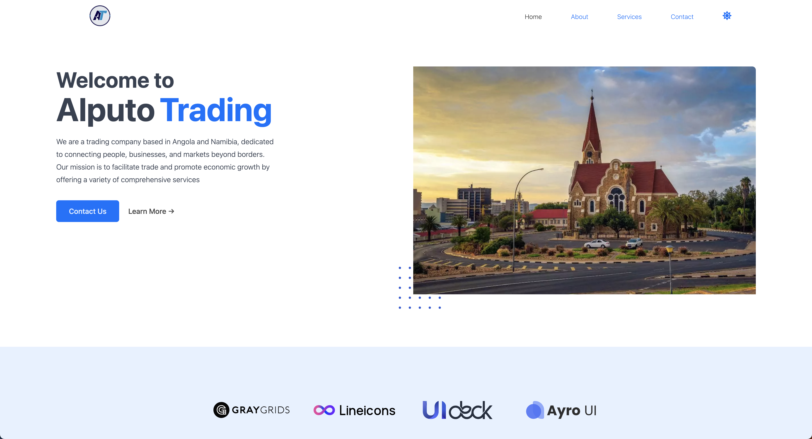

#  Alputo Trading Website

A modern company website built with **React + TailwindCSS** that showcases the services of **Alputo Trading**, a leading trading and services company operating in Angola and Namibia.  

The platform highlights the company’s mission, services, and values, while providing an elegant, responsive, and user-friendly design.

---

##  Features

- ⚡ **Modern Hero Section** with company introduction & call-to-action  
-  **Services Showcase** — General trade, Import/Export, Logistics, Consulting, Money Transfer, Tourism  
-  **About Section** with company mission, vision, and values  
-  **Featured Section** with what sets Alputo apart  
-  Built with **TailwindCSS** for responsive and modern design  
-  **Dark Mode** support for a sleek UI experience  
-  Fully **responsive layout** (desktop, tablet, mobile)  

---

## 🖼️ Preview


---

##  Tech Stack

- [React](https://react.dev/) – Frontend framework  
- [TailwindCSS](https://tailwindcss.com/) – Styling & responsive layout  
- [JavaScript (ES6+)](https://developer.mozilla.org/en-US/docs/Web/JavaScript) – Logic & interactivity  
- [React Router](https://reactrouter.com/) – Client-side routing  

---

##  Getting Started

Follow these steps to run the project locally:

### 1️⃣ Clone the repository
```bash
git clone https://github.com/Sacarima/Alputo-Trading
cd alputo-trading
